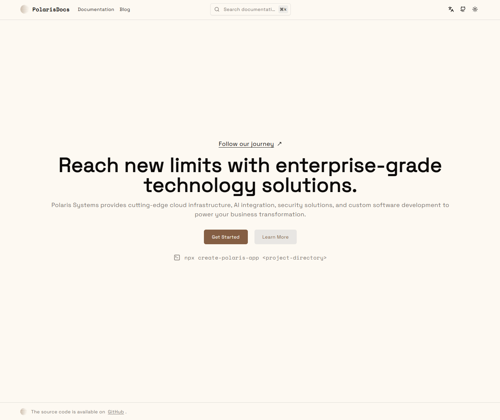
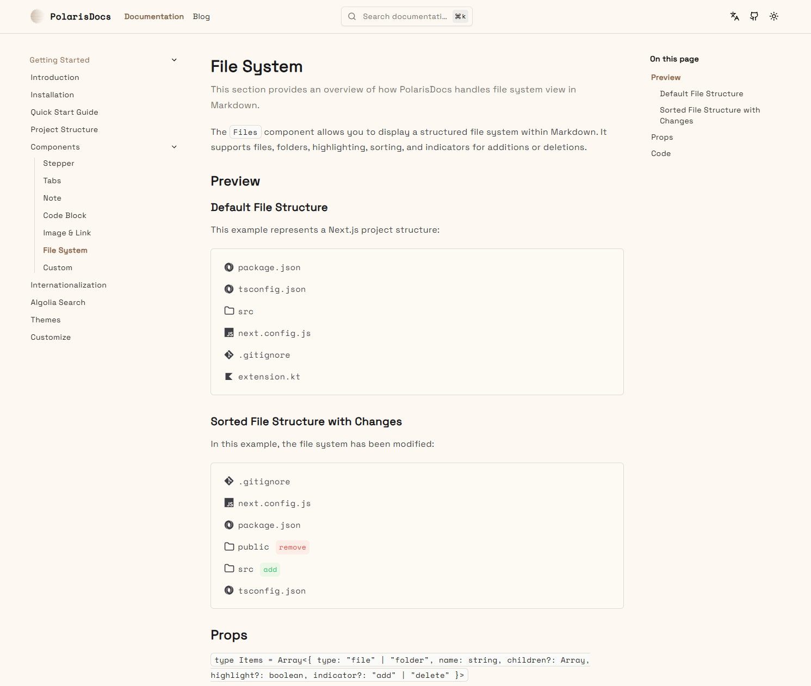
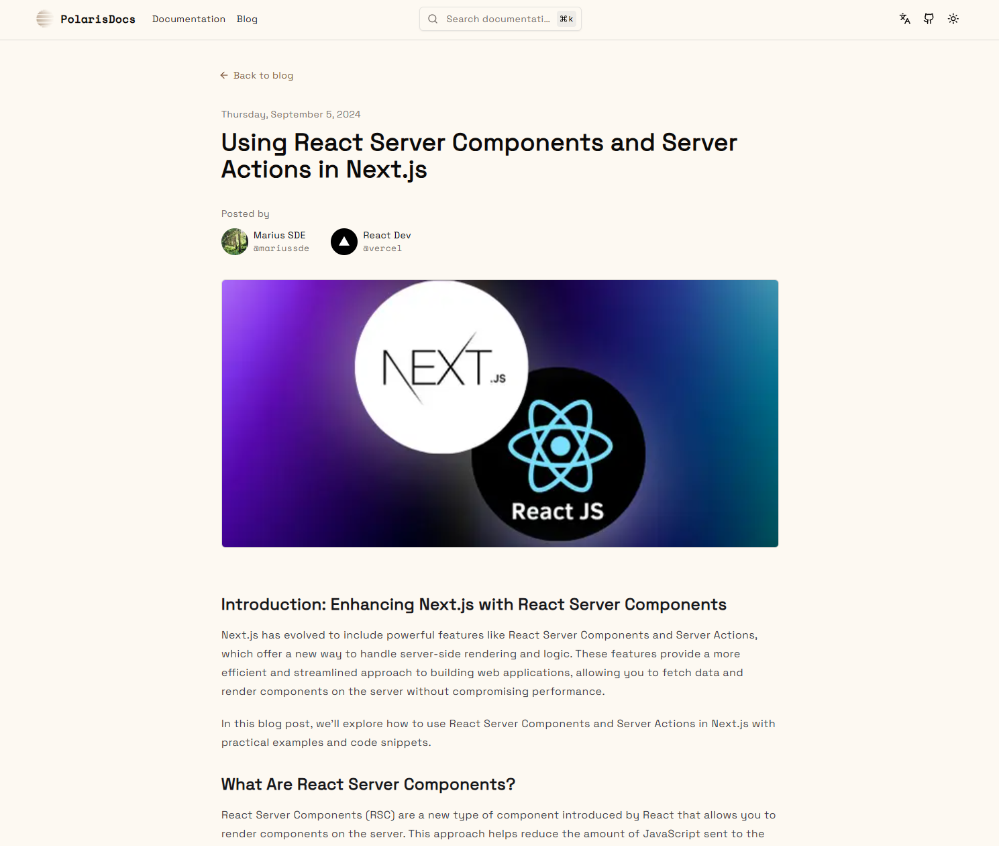

# Polaris Systems - Enterprise Technology Solutions Documentation

Polaris Systems delivers enterprise-grade cloud infrastructure, AI integration, security solutions, and custom software development for modern businesses. This comprehensive documentation platform showcases our cutting-edge solutions and helps you reach new limits with enterprise-grade technology.

<br/>

### Expected Output

When you run the CLI, you can expect an output similar to this:

```
Creating a new Polaris Systems project in /path/to/your/project from the master branch...
Cloning Master (Full Documentation)...
Polaris Systems project successfully created in /path/to/your/project!

Next steps:
1. Navigate to your project directory:
   cd <project-directory>
2. Install dependencies:
   // To support React 19, package maintainers will need to test and update their packages to include React 19 as a peer dependency. This is already in progress.
   npm install --force 
3. Start the development server:
   npm run dev
```

## Getting Started

First, run the development server:

```plaintext
npm run dev
# or
yarn dev
# or
pnpm dev
# or
bun dev
```


## Our Solutions

| **Solution**                  | **Description**                                          |
|-------------------------------|----------------------------------------------------------|
| Cloud Infrastructure          | Enterprise-grade cloud solutions for scalable operations |
| AI Integration                | Seamless AI integration for business transformation      |
| Security Solutions            | Comprehensive security frameworks and protocols          |
| Custom Software Development   | Tailored software solutions for your unique needs        |
| Documentation Platform        | Interactive documentation with MDX support               |

## Platform Features

| **Feature**                   | **Description**                                          |
|-------------------------------|----------------------------------------------------------|
| MDX Support                   | Write interactive documentation with MDX.                |
| Nested Pages                  | Organize content in a nested, hierarchical structure.    |
| Blog Section                  | Share insights and updates through our blog platform.    |
| Table of Contents             | Auto-generated TOC for easy navigation.                  |
| Pagination                    | Split content across multiple pages.                     |
| Syntax Highlighting           | Highlight code for better readability.                   |
| Code Line Highlighting & Titles | Highlight specific lines with descriptive titles.      |
| Interactive Code Blocks       | Language-specific and interactive code display.          |
| Custom Components             | Embed custom, reusable components in your docs.          |
| Light & Dark Mode             | Toggle between light and dark themes.                    |
| Search Functionality          | Quickly find content with a built-in search.             |
| Code Switcher                 | Switch between code languages or variations.             |
| Code Copy                     | Copy code blocks with a single click.                    |
| TOC Observer Highlight        | Highlight active sections in the TOC as you scroll.      |
| Static Site Generation        | Generate a static, high-performance site.                |
| SEO-Optimized                 | Structured for optimal search engine indexing.           |
| Internationalization          | Multi-language support for global reach                  |

## Documentation Sections

Our comprehensive documentation covers:

- **Getting Started**: Introduction, installation, and quick start guides
- **Components**: Stepper, tabs, notes, code blocks, and custom components
- **Advanced Features**: File systems, image & link handling, internationalization
- **Integration**: Algolia search integration and theme customization
- **Examples & Guides**: Practical examples and implementation guides





## Follow Our Journey

Stay updated with the latest developments, insights, and news from the Polaris Systems team. Our documentation platform is open source and available for contribution.

---

*Built with enterprise-grade technology to power your business transformation.*
